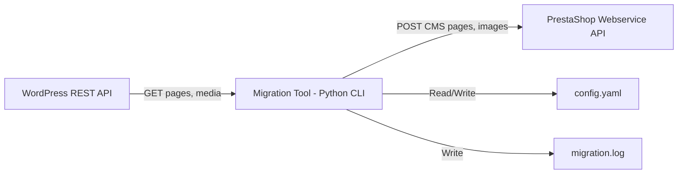

# Architecture: WP→Presta Migration Tool

## System Overview



## Module Structure

```
src/
├── main.py              # CLI entry point (argparse)
├── config.py            # Config loader (YAML)
├── wp_client.py         # WordPress REST API client
├── ps_client.py         # PrestaShop Webservice API client
├── migrator.py          # Orchestration: extract → transform → load
├── transformers.py      # HTML content transformation (image URL rewriting)
└── utils.py             # Logging setup, helpers
config.example.yaml      # Template configuration
requirements.txt         # Dependencies
README.md                # Usage documentation
```

## Data Flow (ETL Pipeline)

### Extract (WordPress)
| Endpoint | Data |
|----------|------|
| `GET /wp-json/wp/v2/pages?per_page=100&status=publish` | All published pages |
| `GET /wp-json/wp/v2/media/{id}` | Individual media metadata |
| `GET {media.source_url}` | Binary image download |

### Transform
| WP Field | → | PrestaShop Field | Notes |
|----------|---|------------------|-------|
| `title.rendered` | → | `meta_title` | HTML entities decoded |
| `content.rendered` | → | `content` | Image URLs rewritten |
| `slug` | → | `link_rewrite` | Direct mapping |
| `excerpt.rendered` | → | `meta_description` | Stripped of HTML tags |
| `yoast_head_json.title` | → | `meta_title` | Override if Yoast available |
| `yoast_head_json.description` | → | `meta_description` | Override if Yoast available |

### Load (PrestaShop)
| Action | API | Method |
|--------|-----|--------|
| Create CMS category | `/api/content_management_system_categories` | POST XML |
| Create/Update CMS page | `/api/content_management_system` | POST/PUT XML |
| Check existing page | `/api/content_management_system?filter[link_rewrite]={slug}` | GET |

## Key Design Decisions

### 1. PrestaShop API Format → XML
PrestaShop Webservice uses XML, not JSON. All payloads must be constructed as XML.

### 2. Idempotency Strategy
Match pages by `link_rewrite` (slug). If exists → PUT update. If not → POST create.

### 3. Image Handling
1. Parse HTML content for `` tags
2. Download each image from WP
3. Upload to PrestaShop `/img/cms/` directory (via FTP or direct file copy if same server)
4. Rewrite `src` URLs in HTML content before injecting into PrestaShop

### 4. Multi-Language
PrestaShop CMS pages support `language` nodes. Default to `id_lang=1` (French). Config-driven.

### 5. Error Handling
- Per-page try/catch: one page failure doesn't stop the batch
- All errors logged with page title and error detail
- Summary at end: X pages migrated, Y failed, Z images transferred

## Configuration Schema

```yaml
wordpress:
  url: "https://www.kortel-design.com"
  # No auth needed for public REST API (published pages)

prestashop:
  url: "https://shop.kortel-design.com"
  api_key: "YOUR_PRESTASHOP_WEBSERVICE_KEY"
  default_lang_id: 1  # French
  cms_category_id: 1  # Target CMS category in PrestaShop

migration:
  dry_run: false
  log_file: "migration.log"
  download_images: true
  image_target_dir: "/var/www/prestashop/img/cms/"  # Or use API
```

## Dependencies

```
requests>=2.28
pyyaml>=6.0
lxml>=4.9    # XML construction for PrestaShop API
beautifulsoup4>=4.12  # HTML parsing for image URL rewriting
```
